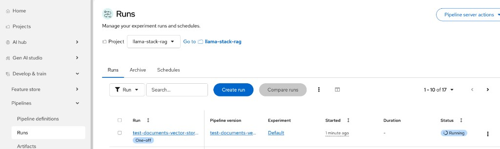
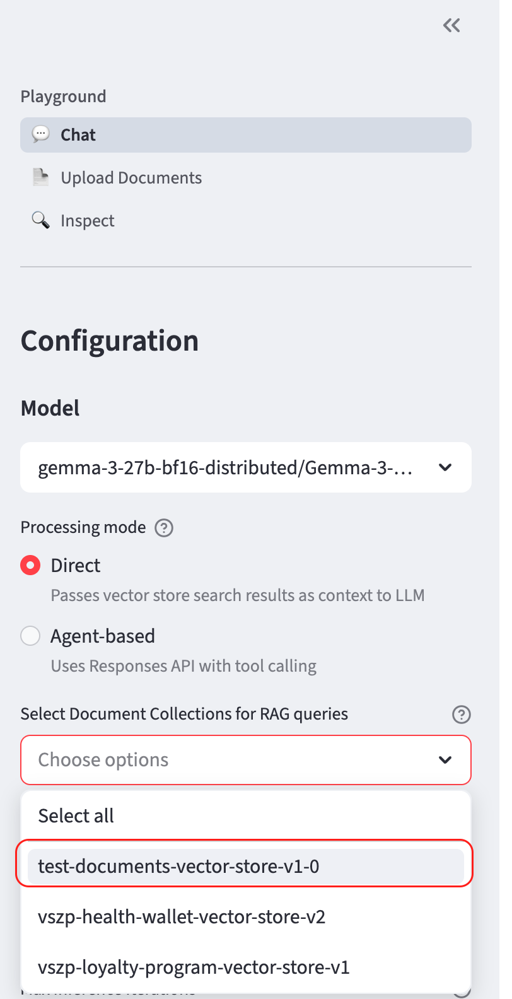

# Trigger Ingestion Pipeline

Quickly create a vector store from documents in the MinIO bucket.

## 1. Port-forward to the ingestion service

```bash
oc port-forward -n llama-stack-rag svc/rag-ingestion-pipeline 8000:80
```

## 2. Run the script

```bash
python scripts/trigger-pipeline.py \
    --type s3 \
    --name test-documents-vector-store \
    --bucket documents
```

Run `python scripts/trigger-pipeline.py --help` for all options (URL, GitHub, custom embedding model, etc.).

## 3. Verify the pipeline is running via RHOAI dashboard

```bash
oc get workflow -n llama-stack-rag
```

We should see it in the OpenShift AI dashboard under **Pipelines > Runs**:



## 4. Use the new vector store

Once the pipeline completes, the vector store appears in the RAG UI under **Select Document Collections**:



## 5. Delete a vector store (optional)

```bash
oc port-forward -n llama-stack-rag svc/rag-ingestion-pipeline 8000:80

curl -X DELETE "http://localhost:8000/delete?pipeline_name=test-documents-vector-store-v1-0"
```
